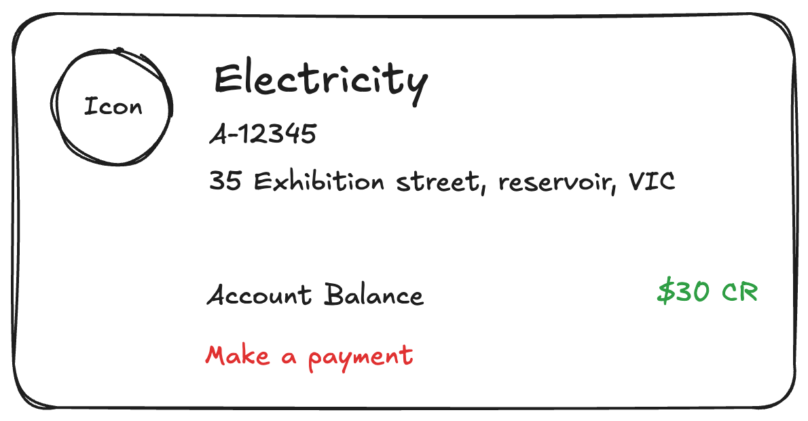
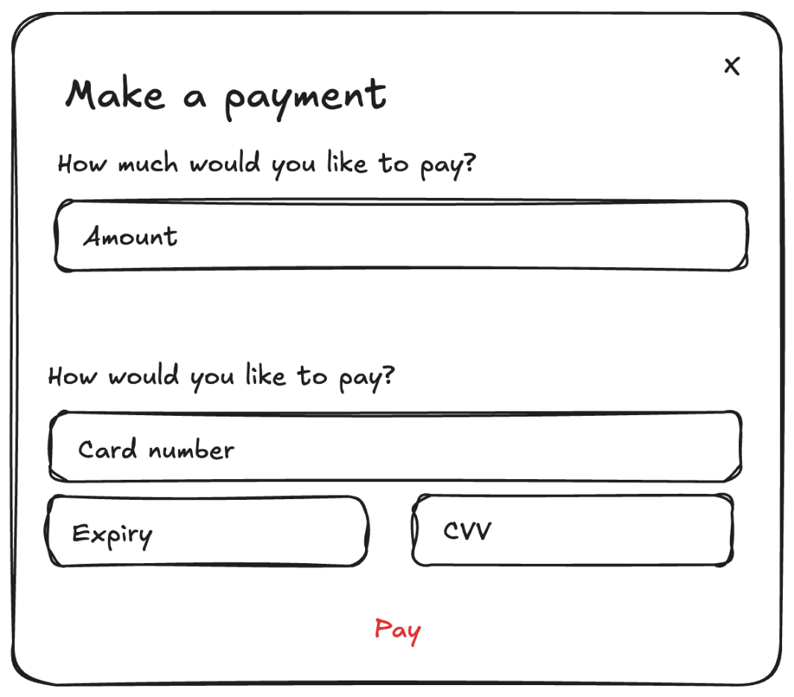

# 🧪 Take Home Challenge

Build a React + Node.js application that renders a customer's energy accounts and allows a user to make a credit card payment.

### 💡 Our guidance
- You may choose whichever technology stack and libraries you are comfortable with.
- This challenge covers both backend and frontend but **feel free to only focus on the area you are more comfortable with how we would obviously expect a more comprehensive solution if you only choose one avenue.**.
    - Showcase just the **frontend** by mocking backend calls.
    - Showcase just the **backend** with tests or Swagger documentation.
    - Showcase both.
- We value **modern workflows**, so feel free to use **AI tools**, but be ready to discuss your solution.
- We value your time. we're interested in **code quality and design decisions** not completeness of the AC's.
  - Limit yourself to around 4 hours.
  - You can add comments where and how you'd expand given more time.
  - Pixel perfect UI or good UX design is not something we will be assessing.
- **TypeScript** is essential to our platform — we encourage you to showcase its use.
- Your code should **compile and run easily**.
  - A simple `yarn start` (or `npm start`) for frontend and backend is preferred.
- Testing is key in our platform, please include tests to show us you have a good understanding of testing principles and your own code.

### 🎨 Frontend Acceptance Criteria (ACs)å

Build a react app to display energy data and make payments.
- ✅ Implement a page that renders a list of customer energy accounts.
- ✅ Fetch energy accounts from the backend.
- ✅ The accounts should be rendered in a Card UI format stacked on top of each other and centered on the page.
- ✅ The account balance should change color based on the value:
    - Positive: **green**
    - Negative: **red**
    - Zero: **grey**
- ✅ Implement a filter for filtering accounts by energy type.
- ✅ Clicking on the "Make a Payment" button should open a modal with:
    - title
    - credit card details
    - balance
    - A "Pay" button
- ✅ Clicking the "Pay" button should submit the credit card details to the backend, and on success, show a “Payment Successful” view with a close button.
- ✅ Implement a different page/view that shows a history of payments made.
- ✅ Implement a search feature to search by account address.

Example card: 

Example payment modal 

### Backend Acceptance Criteria (ACs)

Build out a simple Node.js API.
- ✅ Implement an endpoint to fetch energy accounts which internally calls the energy accounts API and the due charges API.
- ✅ The api response should calculate the balance for each account by adding up the due charges for each account.
- ✅ Add types where required.
- ✅ Implement an endpoint to process a credit card payment.
- ✅ Test coverage.
- ✅ Mock downstream data sources for energy accounts + credit card processor. See: [Example mocks](./example-mocks/energyAccountsAPIMock.ts)

### 💎 What We Value

- Well-modularised, robust and clearly-written code.
- Maintainability. Another team member should be able to easily work with your code after you've finished.
- Good State management and code layout.
- Solid understanding of react lifecycles , events and data fetching.
- Solid understanding of styling technologies + technologies.
- Solid understanding of modern react design principles and best practise.
- Solid understanding of modern Node.js best practises.
- Solid understanding of API design.
- Solid understanding of TypeScript.
- Solid understanding of security principles.

### 🚀 Presenting your code

Add your code to the `codebase` folder.

2 Options to submit your code:
- Fork this repository and share the repository link with us.
- Email a zipped copy of your code to Nina Ryu. 
